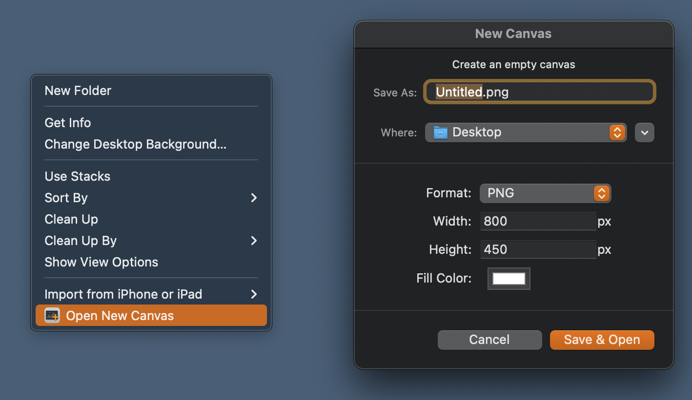
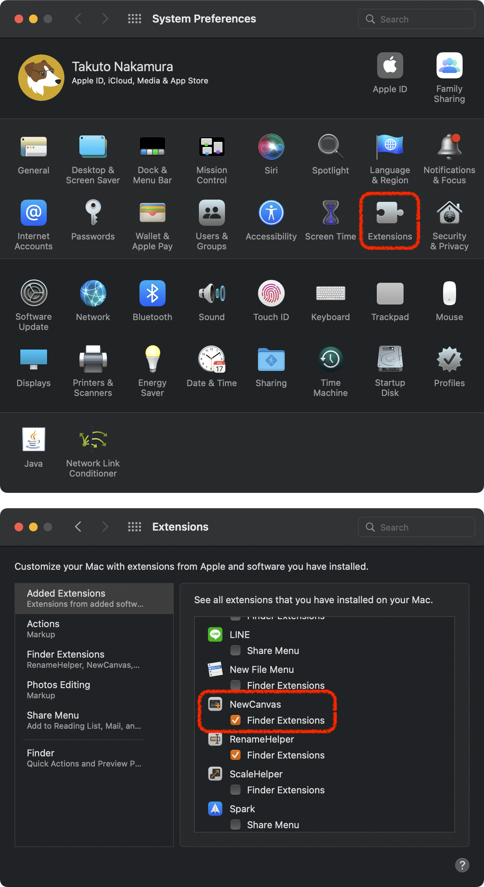

# NewCanvas

<!-- # Short Description -->

Helper app for Preview to create an empty canvas.

<!-- # Badges -->

# Tags

`macOS` `Finder Sync Extension` `Preview` `Swift` `SwiftUI`

# Demo

1. Open the context menu by right-clicking on the background of Desktop or Finder.
1. Select "Open New Canvas".
1. Fill in the filename and the values of the canvas size and so on.
1. A new empty canvas will be opened automatically with Preview.app.

**You can edit and draw objects on the canvas without any original resource!!**

# Advantages

- Simple
- Quick
- No hassle

# Installation

1. [Install NewCanvas via App Store](https://apps.apple.com/us/app/newcanvas/id1574025915?mt=12).
1. Open System Preferences -> Extensions.
1. Check the box of "NewCanvas Extension".

# Contributors

- [Kyome22](https://github.com/Kyome22)
